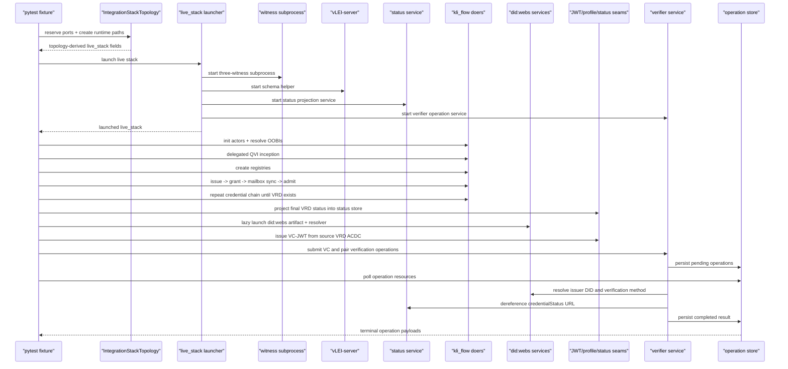

# Integration Maintainer Guide

This guide explains the live integration system in `isomer` the way a
KERIpy maintainer would usually trace it: stack orchestration first, in-process
workflow orchestration second, and W3C projection/verification seams last.

The point is not to teach W3C VC-JWT from scratch. The point is to let a
maintainer answer, quickly and confidently:

- what launches and in what order
- what is shared across a pytest run versus isolated per live stack
- where KERI/TEL truth lives versus where W3C artifacts are projected
- why local wrapper doers exist
- where to start when the live test fails

## Three-Layer Mental Model

The live system is easiest to reason about in three layers:

1. Live stack orchestration
   `tests/integration/conftest.py` and `tests/integration/topology.py`
   own runtime directories, reserved ports, subprocess launch, shared staged
   assets, log files, and the `live_stack` fixture contract.
2. In-process KERI workflow orchestration
   `tests/integration/kli_flow.py` owns actor setup, OOBI resolution,
   delegated inception, registry inception, credential issue/grant/admit, and
   the deterministic cleanup rules needed for strict LMDB behavior.
3. Isomer runtime seams
   `src/vc_isomer/` owns the W3C-facing behavior:
   ACDC-to-VC projection, JWT issuance, did:webs resolution, projected status,
   HTTP service wrappers, and final verification.

The live test uses all three layers in order. The W3C material is not the
source of truth. It is the last projection and verification stage after the
KERI/TEL workflow has already succeeded.

## Source Of Truth

The KERI and ACDC side remains authoritative:

- KEL state is authoritative for identifier state.
- TEL/registry state is authoritative for credential issuance and revocation
  state.
- IPEX exchange state and mailbox delivery drive grant/admit flow.
- W3C VC-JWT artifacts are derived interoperability twins.
- The local status service is a projection of KERI registry state for W3C
  verifier consumption.

If a maintainer is debugging a semantic problem, start from KERI state and
only then inspect the W3C output.

## `live_stack` Contract

`live_stack` is the mutable runtime contract passed through the live test and
the workflow helpers.

Topology-derived fields are created by `IntegrationStackTopology.as_live_stack()`
before any service launches:

- `runtime_root`, `config_root`, `log_root`, `temp_root`
- `home`
- `host`
- `witness_ports`
- `witness_oobis`
- `vlei_schema_url`
- `schema_oobis`
- `dws_artifact_url`
- `dws_resolver_url`
- `status_base_url`
- `verifier_base_url`

Runtime-populated fields are attached by `_launch_live_stack(...)` as services
come up:

- `schema_root`, `cred_root`, `oobi_root`
- `runtime_procs`
- `open_logs`
- `witness_aids`
- `status_store`
- `launch_did_webs`
- `did_webs_running`

Service-facing fields are mostly URLs, ports, binaries, and directories used by
subprocesses. Workflow-facing fields are the HOME sandbox path, witness AIDs,
status store, and the lazy `did:webs` launcher used during the W3C issuance
phase.

## Shared Versus Per-Stack Runtime State

There are two kinds of temp state in the fixture:

- `tmp_path_factory.getbasetemp()`
  used once per pytest session or worker as a shared staging root
- `tmp_path_factory.mktemp(...)`
  used per stack launch attempt as the isolated runtime root

In practice:

- shared staged vLEI assets live under
  `<basetemp>/shared-vlei-assets/`
- each stack gets its own runtime root with:
  - `config/`
  - `logs/`
  - `tmp/`
  - HOME-backed `.keri` state under that runtime root

The shared area exists to avoid restaging identical schema files for every test
runtime. The isolated runtime root exists so each stack has its own HOME,
keystore, registry LMDBs, logs, and status store.

## Service Process Model

The live stack launches four services immediately and one lazily:

1. Witness subprocess
   Runs the three witness aliases `wan`, `wil`, and `wes` in one process.
2. `vLEI-server`
   Serves schema OOBIs and optional helper material from vendored assets.
3. Status service
   Serves W3C-facing credential status resources from the local JSON status
   store.
4. Verifier service
   Accepts verification submissions, persists long-running operation state, and
   runs verification work in background HIO doers.
5. `did:webs` artifact and resolver services
   Started lazily only when the workflow reaches W3C issuance and verification.

The lazy launch matters. The KERI issuance path does not need `did:webs`.
Starting it only for the W3C phase keeps the stack mental model honest.

## Live Test Phase Model

The flagship live test proceeds through stable phases:

1. Stack launch and HOME sandbox setup
2. Actor keystore/bootstrap setup
3. OOBI resolution between participants
4. Delegated QVI inception
5. TEL registry creation
6. Credential issue/grant/admit chain:
   GEDA -> QVI -> LE -> VRD Auth -> VRD
7. Status projection for the final VRD credential
8. Lazy `did:webs` launch
9. VC-JWT issuance from the source VRD ACDC
10. Verifier-operation submission and polling
11. did:webs resolution, status dereference, and dual isomer verification

For a KERIpy maintainer, the key boundary is between phase 6 and phase 9.
Everything before phase 9 is the real issuance workflow. Phase 9 onward is the
projection and verification seam.

## Why Mailbox Sync Appears Before Admit

`AdmitDoer` expects the referenced `/ipex/grant` exchange message to already
exist in the recipient store. That is why the integration layer performs an
explicit mailbox sync phase before admission.

The ordering is:

- grant sender creates and sends `/ipex/grant`
- recipient mailbox director receives `/credential` traffic
- helper waits until the exact grant exchange SAID is present locally
- only then does the admit workflow run

Without that explicit sync, admit would race mailbox delivery and the failure
would look like an IPEX or registry bug when it is really a sequencing bug.

## Isomer Runtime Seams

The live test exercises these runtime responsibilities:

- `profile.py`
  semantic projection from supported ACDCs into the repo's W3C VC shape
- `jwt.py`
  binding projected payloads to live KERI habitat signing keys
- `didwebs.py`
  narrow resolver seam for did:webs key-state lookup
- `status.py`
  local projection store and HTTP fetch abstraction for W3C status documents
- `service.py`
  thin HIO/Falcon HTTP wrappers around projected status and verifier
  submission/polling
- `verifier.py`
  pure verification engine for W3C verification plus source ACDC / projected VC
  equivalence checks
- `verifier_runtime.py`
  long-running HIO doers that execute verifier operations without doing outbound
  HTTP inside Falcon handlers
- `longrunning.py`
  local KERIA-shaped operation monitor, resources, and LMDB persistence for
  verifier jobs
- `verifier_client.py`
  CLI and integration-facing client for submit/list/get/delete/wait operation
  flows
- `cli/`
  thin command package that composes these runtime seams by command family

The key maintainer rule is that the CLI package is not the architecture. The
runtime modules are the architecture. CLI modules are only thin adapters.

## Readability Rule

Keep orchestration helpers readable in the same way we keep protocol layers
separate:

- use early returns when no bootstrap work is needed
- use named local `ready()` / `observe()` functions when a polling condition
  has domain meaning
- keep setup, run, and cleanup phases visually distinct
- make resource ownership explicit whenever a helper opens LMDB-backed KERI
  resources
- prefer phase-shaped helper functions over one giant narrated test body

The real smell is not “long function.” The real smell is mixing setup,
polling logic, and teardown in one dense block with unnamed lambdas.

## Sequence Diagram

## Current Debt / Non-Ideal Seams

- `IsomerRuntime` owns the local KERI lifecycle for W3C projections.
  It opens Habery/Hab/Regery state and provides an `ACDCProjector` plus signer.
  The projector itself is intentionally non-owning: it only projects accepted
  KEL/TEL/ACDC state into W3C-facing isomers.
- `IsomerSignerRuntime` is the signer-only variant for commands that need a
  live habitat signer but not Regery/TEL projection state.
  `HabSigner` is intentionally non-owning and only adapts an already-opened Hab.
- Local managed doer wrappers are integration debt.
  They exist because several upstream KERI CLI doers open `Notifier`,
  `Regery`, and related LMDB-backed resources without exposing enough handles
  for deterministic cleanup under strict LMDB behavior.
- The JSON-file-backed status service is a deliberate POC seam, not a
  production credential-status architecture.
- `vLEI-server` is a helper for schema and OOBI material in the live stack.
  It is not a source of truth for issued credentials.
- The preferred end state is to upstream LMDB ownership fixes into KERIpy and
  delete the local managed wrappers once the pinned KERI dependency exposes the
  needed cleanup seams.

## Where To Start Debugging

Use this order:

1. stack launch and logs
2. topology-derived URLs and ports
3. actor HOME sandbox and `.keri` state
4. OOBI resolution and witness-backed key state
5. registry/TEL state
6. exchange and mailbox state
7. status projection
8. did:webs resolution
9. W3C token issuance and verification

If you start from the JWT when the registry state is wrong, you are debugging
the shadow instead of the source.
